A fully implemented python module for shapes drawing and management
===================
##### Requirements for running, in addition to the standard library and numpy
- **pyclipper**, a package for polygon boolean operations
- **shapely**, a package for line offsetting calculations


## Demo of key features for the software 
**See the jupyter notebook which you can run yourself; or the HTML file for better read-only viewing experience**

```python
import numpy as np
from shape_drawing import Polygon, Line, PyplotViewer, Canvas
```

### Polygon drawing and transformations

Defining a polygon is simple: Just pass in a name, a list of coordinates, a color and layer number


```python
square = Polygon('my_square', [(1,1), (1,3), (3,3), (3,1)], 'red', 10)
```

Coordinates of a shape are read-only


```python
square.coordinates
```


    [[1, 1], [1, 3], [3, 3], [3, 1]]


```python
try:
    square.coordinates = [[2,7]]
except AttributeError as e:
    print(e)
```

    can't set attribute


Before we get started, let's also create a viewer. This will let us actually visualize the shapes we draw


```python
viewer = PyplotViewer(figsize=(5,5))
```


```python
square.view(viewer)
```


    
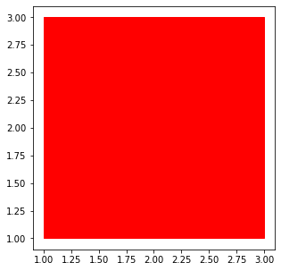
    


The simple string representation of the output has useful information too. I will explain what "gen_num" is in a bit.


```python
square
```


    shape object <name:my_square|type:Polygon|layer:10|gen_num:0>


We can apply a number of transformations to our shape. There are **translation**, **rotation**(around an arbitary point), **reflection**(across an arbitary line in x-y plane), **union**(with another shape), **intersection**(with another shape), **scale**, **offseting** (also known as dilation, basically adding width to a line) and **arbitary transformation**(user provides a transformation matrix).

Here we apply a rotation of pi/4 around the point (2,2) to the square we just created:


```python
diamond = square.rotate(np.pi/4, origin=[(2,2)])
diamond
```


    shape object <name:my_square|type:Polygon|layer:10|gen_num:1>


Note that the transformed shape is a different object with the same name. The generation number, or "gen_num", is an attribute of the shape and it essentially tells how many transformations it takes to get to the current shape from its ancestor. More details to come


```python
diamond.view(viewer)
```


    
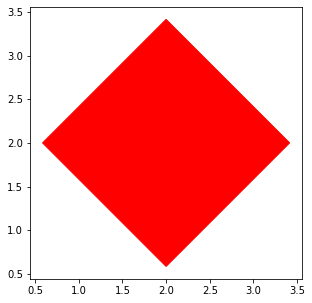
    


Apply another transformation, scaling this time:


```python
diamond_scaled = diamond.scale(0.5)
diamond_scaled
```


    shape object <name:my_square|type:Polygon|layer:10|gen_num:2>


```python
diamond_scaled.view(viewer)
```


    
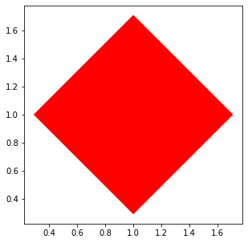
    


We can actually examine the entire transformation history of a shape by invoking its **traverse_transform_tree()** method, which basically does a *post-order traversal* from its ancestor to itself. The tree shows all the steps, including inputs and transformations involved throughout the shapes evolution.

The output of this traversal is list of TransformTreeDesc, which is a named tuple that contains the ancestrial shapes and transformation at each generation.

For example:


```python
transform_tree = diamond_scaled.traverse_transform_tree()
for node in transform_tree:
    print(node)
    print()
```

    TransformTreeDesc(gen_num=1, inputs=[shape object <name:my_square|type:Polygon|layer:10|gen_num:0>, 0.7853981633974483, [(2, 2)]], transform=ROTATE-->shape object <name:my_square|type:Polygon|layer:10|gen_num:1>)
    
    TransformTreeDesc(gen_num=2, inputs=[shape object <name:my_square|type:Polygon|layer:10|gen_num:1>, 0.5], transform=SCALE-->shape object <name:my_square|type:Polygon|layer:10|gen_num:2>)
    


It shows that at generation \#1, we took the very first square which started at gen_num 0, applied a rotation with the correspoinding angle(pi/4=0.79) and origin((2,2)) to get to the rotated square at gen_num 1; then at generation \#2, we scaled the square in gen_num 1 by half.

This tree framework will be very useful in a design process to know how different shapes came about. Its usefulness is particularly obvious when we curry/chain different transformations together *without* having to save intermediate shapes.

We will demonstrate this now.

### Transformation currying

Let's apply the following transformations to a shape **all in one go**: a rotation, a scale, an union with another shape, and finally a reflection. In this currying implementation, a nice feature is that **input shapes are not modified and hence preserved**. 


We will first make the second shape that will be unioned during this transformaton chain


```python
rect = Polygon('random_rectangular', [(-1,1), (-1,3), (7,3), (7,1)], 'blue', 10)
rect.view(viewer)
```


    
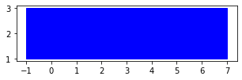
    


And now we start, here's the starting shape:


```python
square_start = Polygon('target_square', [(1,1), (1,3), (3,3), (3,1)], 'blue', 10)
square_start.view(viewer)
```


    
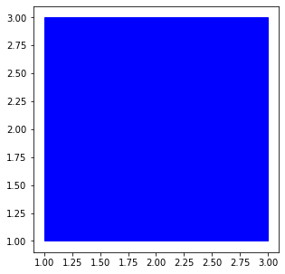
    


Currying all the transformations together:

* rotate
* scale
* union
* reflect


```python
rotate_angle = np.pi / 3
rotate_origin = [(2, 2)]
scale = 2
reflect_line = [(0, 0), (-1, 1)]

shape_final = square_start.rotate(rotate_angle, origin=rotate_origin).scale(scale).union(rect).reflect(reflect_line)
shape_final.view(viewer)
```


    
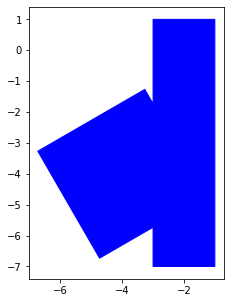
    


Even though we didn't save any intermediate shapes, we have access to all of them through the transform tree


```python
transform_tree = shape_final.traverse_transform_tree()
for node in transform_tree:
    print(node)
    print()
```

    TransformTreeDesc(gen_num=1, inputs=[shape object <name:target_square|type:Polygon|layer:10|gen_num:0>, 1.0471975511965976, [(2, 2)]], transform=ROTATE-->shape object <name:target_square|type:Polygon|layer:10|gen_num:1>)
    
    TransformTreeDesc(gen_num=2, inputs=[shape object <name:target_square|type:Polygon|layer:10|gen_num:1>, 2], transform=SCALE-->shape object <name:target_square|type:Polygon|layer:10|gen_num:2>)
    
    TransformTreeDesc(gen_num=3, inputs=[shape object <name:target_square|type:Polygon|layer:10|gen_num:2>, shape object <name:random_rectangular|type:Polygon|layer:10|gen_num:0>], transform=UNION-->shape object <name:target_square|type:Polygon|layer:10|gen_num:3>)
    
    TransformTreeDesc(gen_num=4, inputs=[shape object <name:target_square|type:Polygon|layer:10|gen_num:3>, [(0, 0), (-1, 1)]], transform=REFLECT-->shape object <name:target_square|type:Polygon|layer:10|gen_num:4>)
    


We can easily access an intermediate shape, for example if we want to see just before the final reflection:


```python
transform_tree[3].inputs[0].view(viewer)
```


    
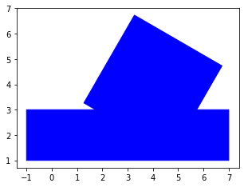
    


### Polygon properties

Area


```python
transform_tree[3].inputs[0].area()
```


    25.999999997766274


Perimeter


```python
transform_tree[3].inputs[0].perimeter()
```


    29.790302291346805


Bounding box


```python
transform_tree[3].inputs[0].bounds()
```


    array([[-1.        ,  1.        ],
           [-1.        ,  6.73205081],
           [ 7.        ,  6.73205081],
           [ 7.        ,  1.        ]])


### Line drawing and transformation

Similar API as polygon (they both inherit from BaseShape class):


```python
simple_line = Line('my line', [(2,2), (3,1), (1,-1), (-1,3), (-3,4), (1,7)], color='orange', layer=10)
simple_line.view(viewer)
```


    
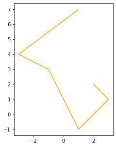
    


```python
simple_line.width
```


    0


```python
simple_line.perimeter()
```


    15.950844619618655


Apply offsets such that the line looks "dilated" and has a width:


```python
dilated = simple_line.offset(0.2)
dilated.view(viewer)
```


    
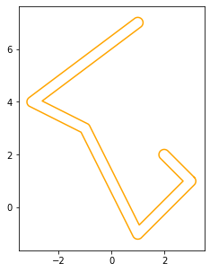
    


*Note that the dilated shape is actually a different class now*


```python
dilated
```


    shape object <name:my line|type:DilatedLine|layer:10|gen_num:1>


```python
dilated.perimeter()
```


    49.87516259090645


Since it's derived from the Polygon class and we can also apply polygon boolean operation on it with other polygons!


```python
diamond_plus_line = diamond.union(dilated)
diamond_plus_line.view(viewer)
```


    
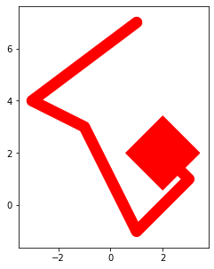
    


###  Canvas -- the drawing board

So far we have just drawn indivudal shapes and left them alone in memory after creation. Now I show how we can orgnize them and store them, basically having a drawing board! This is where Canvas comes in


```python
canvas = Canvas()
```

Canvas allows you to draw on it directly or add existing shapes:


```python
canvas.draw_polygon('my_rectangular', [(1,1), (1,2), (3,2), (3,1)], 'blue', 11)
canvas.draw_polygon('my_triangle', [(4,1), (5,7), (8, 3)], 'purple', 5)
canvas.add_shape(diamond_plus_line)
```


```python
canvas
```


    shape object <name:my_rectangular|type:Polygon|layer:11|gen_num:0>
    ---------------------------------------
    shape object <name:my_triangle|type:Polygon|layer:5|gen_num:0>
    ---------------------------------------
    shape object <name:my_square|type:Polygon|layer:10|gen_num:2>
    ---------------------------------------
    total number of top shape objects in this canvas: 3


We can view an individual shape:


```python
canvas['my_triangle'].view(viewer)
```


    

    


Or all together:


```python
canvas.view(viewer, show_label=True)
```


    
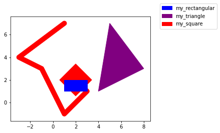
    


We can remove shapes:


```python
canvas.remove_shape('my_rectangular')
canvas
```


    shape object <name:my_triangle|type:Polygon|layer:5|gen_num:0>
    ---------------------------------------
    shape object <name:my_square|type:Polygon|layer:10|gen_num:2>
    ---------------------------------------
    total number of top shape objects in this canvas: 2


Each shape has a **top** attribute which points to the final transformed shape coming from it, essentially the root of the transform tree. When we store or draw a shape on the canvas object, it has access only to this "top" shape. This way, when we add a shape and later transform it, canvas has the most up-to-date version of it:


```python
canvas['my_triangle'].rotate(np.pi/2, origin=[(6,4)])
canvas.view(viewer)
```


    
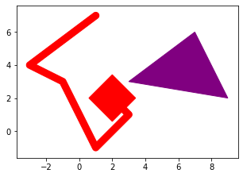
    

